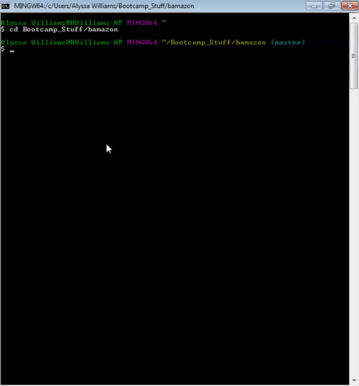
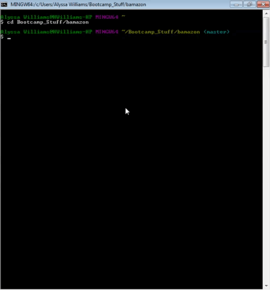
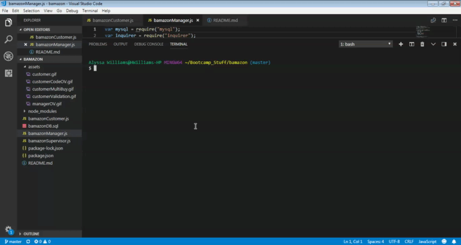
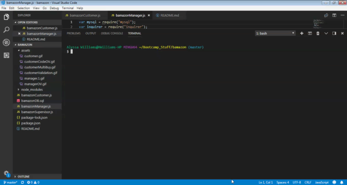

# Bamazon!
## This node.js application has two parts. A customer portal where people can view items for sale, add them to their carts. When they are ready to check out, they are taken to thecart where the total for all items is listed. There is also the manager portal where Bamazon Managers can view products for sale, view low inventory items, add inventory to existing items, or add new products to be sold.

# Built Using
## Standard Javascript, mySQL and Node.js

# Installation, APIs and Credits!
## If you clone this repository, you will need to run an npm install. Another nifty add on to check out is the: 
- [Console.table npm](https://www.npmjs.com/package/console.table)

# Overview of Code
## Customer Portal 

## Manager Portal

# Demo of BAMAZON App!
## Customer Portal

## Manager Portal 

